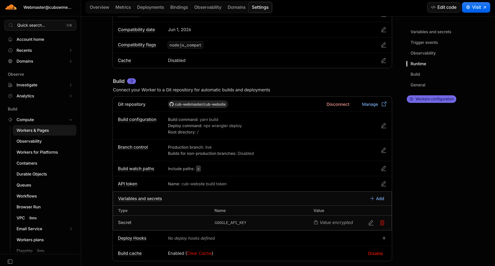
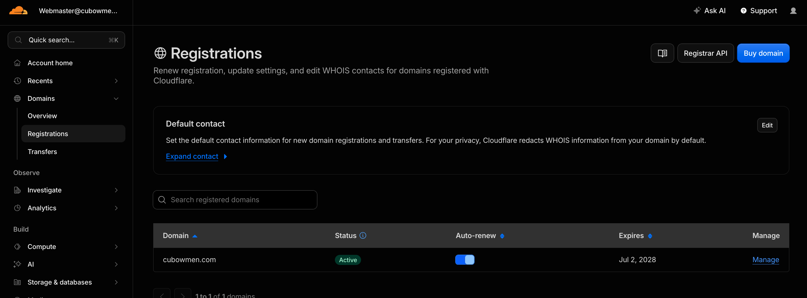

# Hosting

This website is hosted on a Cloudflare Worker, and here we elaborate on the automations that makes the deployment to Cloudflare happen, as well as some basic knowledge necessary to monitor the health of the live website, or troubleshoot when there is an issue.

Ensure you have access to the webmaster Cloudflare account before starting. Contact the previous webmaster if you're not sure you have the details.

## :gear: Deployment Automations

Firstly, the `cub-website` worker (you can find this by going into the "Workers & Pages" section from the sidebar) is connected to this GitHub respository, and watches the `live` branch for updates. Any commits into `live` will trigger a rebuild and redeployment of the live site automatically to reflect the new changes.

This connection, as well the commands to build and deploy the site are set in the `Settings > Build` section. Currently, we use the default build and deploy commands to avoid complications.

However, note that the `wrangler.toml` file in the root directory specifies the configurations used for deployment, and should be your first stop if you are considering changing the way we deploy the website.

You might notice that the environment variables needed for the building and running of the site are also set here. All API keys or environment variables needs to be kept here instead of pushed to the repository so that they can stay secret.

Most deployment issues should be possible to catch at the build stage or are related to env variables, so keep this in mind when troubleshooting.

### :white_check_mark: Previews

When a PR to `live` is opened, we have a GitHub action setup to automatically deploy to a preview worker to ensure that the changes have not caused deployment failures (and to allow a final check that can be easily sent to other committees).

The full code for this automation is in `.github/workflows/preview.yml`. Note that you will have to add in new env variables onto the GitHub repo to make sure they can be accessed by the yaml file, and therefore used in the deployment.

## :pushpin: Domain Management and Renewal

Cloudflare is also our domain registrar and it is the webmaster's responsibility to ensure that we have continued access to the cubowmen.com domain. Make sure you are on top of when a new payment needs to be made. You can find information about renewal on the `Domains > Registrations` page.

In the unlikely scenario that the domain cannot be accessed, despite correct code and deployment settings etc., you can check the DNS records to see if there are any mistakes by selecting the cubowmen domain under `Domains > Overview`. Feel free to also contact Cloudflare support on behalf of the club when necessary.
